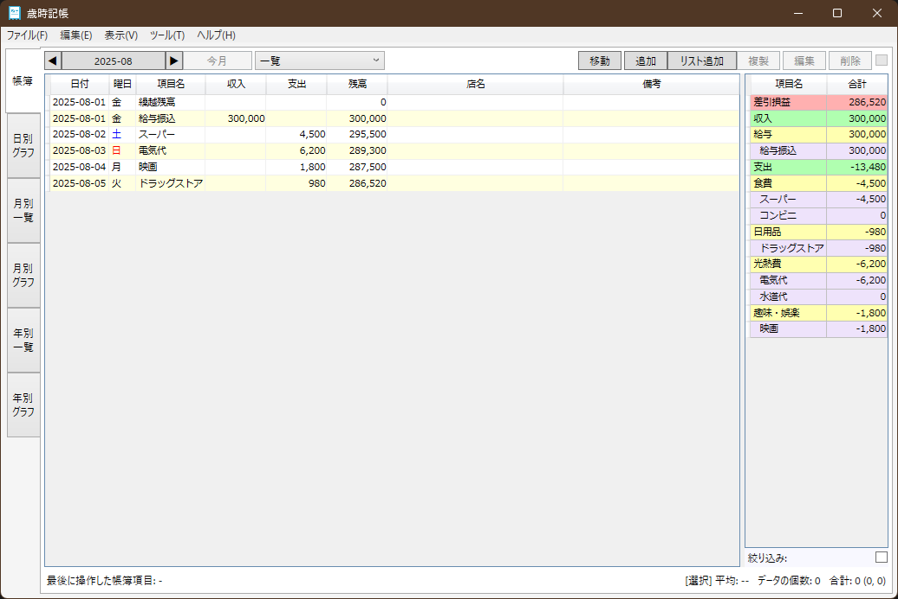
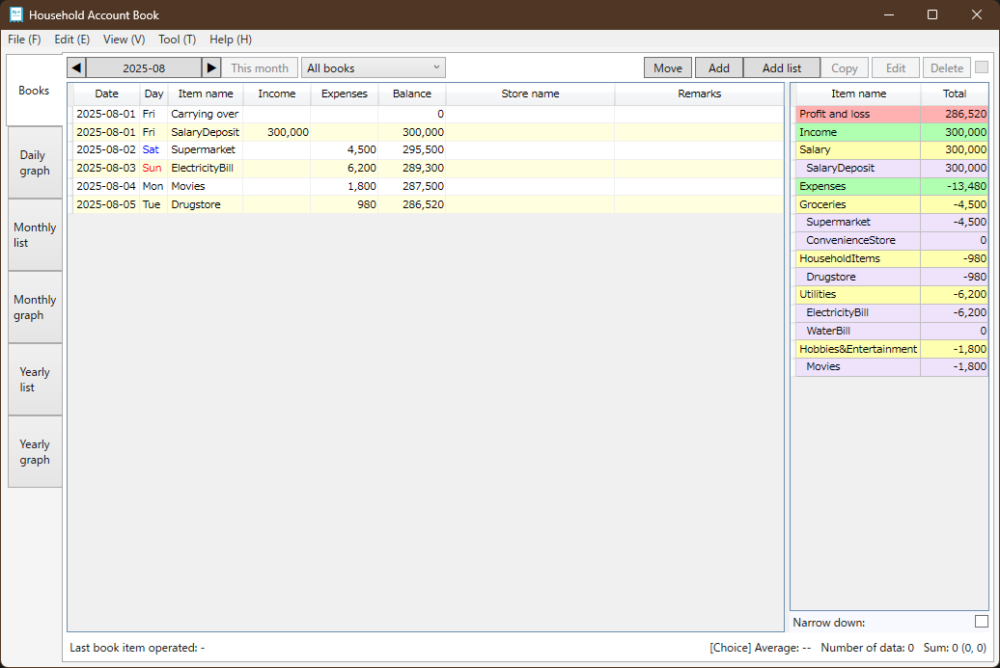

# __歳時記帳(Household Account Book)__

## __Abstract__
This software is for your household accounts book via PostgreSQL or SQLite.  
It is supported for Japanese and English Language, and for Japanese Calcure only.  

## __概要__
本ソフトは家計簿ソフトです。  
家計簿ソフト [記帳風月](https://www.vector.co.jp/magazine/softnews/061024/n0610242.html) から多くのデータの移行が可能です。  
データベースとして、SQLiteおよびPostgreSQLに対応しています。また、それらの相互乗り換えも可能です。  
DBアクセスを高速に実行したいのであれば、PostgreSQLの使用をお勧めしますが、環境の作成に手間が掛かるため、手軽に利用したい場合はSQLiteをお勧めします。

## __開発環境__
* IDE  
  [Visual Studio Community](https://www.microsoft.com/ja-jp/dev/products/community.aspx) 2022  
* DB  
  [PostgreSQL](https://www.postgresql.org/) 17  
  [SQLite](https://sqlite.org/)
* 言語  
  C# (.NET 8.0)

## __機能__
### 実装済
本ソフトは以下のような機能を備えています。
* 「記帳」機能
	* 記帳風月の「記帳」機能に加え、以下をサポートしています。
		* 一覧表示
			* 土日祝の強調表示
			* 表示月の「月別一覧」機能の表示年との連動
			* 「今月」表示
			* 選択した帳簿項目の個数、金額の合計値/平均値の表示
			* 選択した帳簿項目の一括削除
			* 帳簿項目の「追加」または「移動」の追加時に、追加した帳簿項目の選択
			* csv照合結果の表示
		* 帳簿項目の「追加」/「編集」
			* 共通
				* 「店舗」情報の登録
				* 「帳簿」変更時、可能な範囲での分類/項目の選択の維持
				* 日付の「今日」表示
				* 繰返し回数が2回以上の場合
					* 土日祝であった場合に前後の平日への変更
					* 「編集」時に2回目以降のデータを連動して変更するかどうかの選択
			* 「追加」
				* 「追加」クリック時に選択していた帳簿項目の日付と、初期表示「日付」の連動
				* 「続けて入力」クリック時の選択項目の維持、一覧表示の更新
				* 同一の「項目」「店舗」「備考」を持つデータの一括登録(まとめて追加)
		* 帳簿項目の「複製」
		* 「移動」の追加/編集
			* 共通
				* 「移動」登録時の「手数料」の負担の移動元/移動先の選択
				* 移動元と移動先の別の日付での登録
				* 日付の「今日」表示
			* 追加
				* 「移動」クリック時に選択していた帳簿項目の日付と、初期表示「日付」の連動
				* 「移動元」(支払元帳簿)、「日」(支払日)のデフォルト値の設定(クレジットカードのみ)
* 「日別グラフ」機能
	* 全帳簿または選択した帳簿における全項目の指定期間内(日単位)の収支の推移
	* 全帳簿または選択した帳簿における選択項目の指定期間内(日単位)の収支の推移
	* 全帳簿または選択した帳簿における指定期間内(日単位)の残高の推移
* 「月別一覧」機能
	* 記帳風月の「年間一覧」機能に加え、以下をサポートしています。
		* 表示年の「記帳」機能の表示月との連動
		* 「今年」表示
* 「月別グラフ」機能
	* 記帳風月の「グラフ」機能を一部サポートしています。
		* 全帳簿または選択した帳簿における全項目の年間(月単位)の収支の推移
		* 全帳簿または選択した帳簿における選択項目の年間(月単位)の収支の推移
	* また、以下をサポートしています。
		* 全帳簿または選択した帳簿における年間(月単位)の残高の推移
* 「年別一覧」機能
	* 「月別一覧」機能の年別版です。指定した10年間(年単位)の一覧を表示できます。
* 「年別グラフ」機能
	* 「月別グラフ」機能の年別版です。指定した10年間(年単位)の推移を表示できます。
* その他の機能
	* ファイル関連
		* 記帳風月からのインポート
		* データベースのインポート、エクスポート
		* 自動バックアップ
			* メインウィンドウの最小化時(設定可)
			* 本ソフトのクローズ時(設定可)
		* 手動バックアップ
	* ツール関連
		* 「店舗」「備考」の選択候補からの削除
		* 所属する帳簿項目が存在するときに、「帳簿」「分類」「項目」及び帳簿と項目の関連設定の削除抑止
		* csvファイル
			* 照合
			* 追加/編集
	* 操作関連
		* ショートカットキーの充実
	* 言語関連
	    * 日本語/英語対応

### 未実装
記帳風月にある以下の機能は実装の予定がありません。
* 目標金額の設定(「設定値」)
* 「設定」で追加で表示可能な追加機能(「購入予定」「交通費管理」「メモ帳」など)
* 「グラフ」機能における月内の支出項目の割合を示す円グラフの表示
* Excelファイル出力

また、以下の機能は実装の予定がありません。
* .ofx ファイル対応(Open Financial Exchange)

## __SQLiteでの使用方法__
1. 本ソフトを起動し、SQLiteを選択した上で、ファイルの保存場所を設定します(初回のみ)。
1. 「ツール」>「設定」で、必要なマスタデータの作成を行います。
    - 帳簿、分類、項目、帳簿と項目の関連付け
1. さあ、記帳しましょう。

※ 「ファイル」>「インポート」>「記帳風月からインポート」を行うことで、マスタデータを含めて、記帳風月のデータをインポートできます。

## __PostgreSQLでの使用方法__
1. PostgreSQLの環境を構築します。
1. [create_account_book.backup](./docs/DB/create_account_book.backup) を用いて、データベースを構築します(owner:postgres name:account_book)。
   1. CREATE DATABASE までのコマンドを実行します。
   1. DATABASE を選択して、CREATE DATABASE 以降のコマンドを実行します(connectは不要)。
1. 本ソフトを起動し、PostgreSQLを選択した上で、構築したデータベースの接続設定を行います(初回のみ)。
1. 「ツール」>「設定」で、必要なマスタデータの作成を行います。   
    - 帳簿、分類、項目、帳簿と項目の関連付け
1. さあ、記帳しましょう。

※ 「ファイル」>「インポート」>「記帳風月からインポート」を行うことで、マスタデータを含めて、記帳風月のデータをインポートできます。

## __スクリーンショット__
### 日本語

### English

## __免責事項__
* 本ソフトは、すべてのリビジョンにおいて不安定版です。
* データベース仕様は予告なく変更することがあります。
	* データベース仕様の変更時に、必ずしも [データベース仕様書](./docs/DB/DbSpecifications.xlsx) や [create_account_book.backup](./docs/DB/create_account_book.backup) が更新されるとは限りません。
